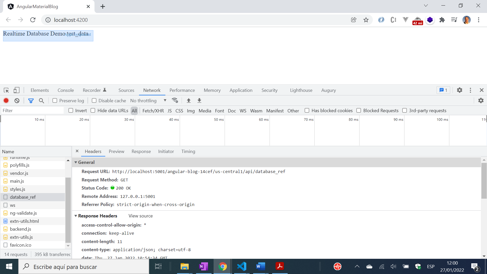

# :zap: Angular Firebase Functions

* Angular app using Firebase tools
* Firebase Functions used with express server to access a realtime database
* **Note:** to open web links in a new window use: _ctrl+click on link_


## :page_facing_up: Table of contents

* [:zap: Angular Firebase Functions](#zap-angular-firebase-functions)
  * [:page_facing_up: Table of contents](#page_facing_up-table-of-contents)
  * [:books: General info](#books-general-info)
  * [:camera: Screenshots](#camera-screenshots)
  * [:signal_strength: Technologies](#signal_strength-technologies)
  * [:floppy_disk: Setup](#floppy_disk-setup)
  * [:computer: Code Examples](#computer-code-examples)
  * [:cool: Features](#cool-features)
  * [:clipboard: Status & To-Do List](#clipboard-status--to-do-list)
  * [:clap: Inspiration](#clap-inspiration)
  * [:file_folder: License](#file_folder-license)
  * [:envelope: Contact](#envelope-contact)

## :books: General info

* Firebase project realtime database key-value pair created in Firebase Console
* Project service account created via Firebase Project Settings then `Create Eervice Account`/Node.js (default option)then `Generate new private key` that adds a json file to the user's PC. The path to this access key file is referenced in the express server `index.ts` file
* This is just a very simple example to demonstrate how a Firebase database function works

## :camera: Screenshots



## :signal_strength: Technologies

* [Angular v14](https://angular.io/)
* [Firebase v9](https://firebase.google.com) Cloud storage and authentication.
* [Firebase Tools v11](https://www.npmjs.com/package/firebase-tools) CLI used to manage a Firebase project
* [AngularFire v7](https://www.npmjs.com/package/@angular/fire) Angular library for Firebase
* [Express v4](https://www.npmjs.com/package/express) Node.js framework

## :floppy_disk: Setup

* Install dependencies using `npm i`
* Run `ng serve` for a dev server. Navigate to `http://localhost:4200/`. The app will automatically reload if you change any of the source files.
* In a 2nd terminal, cd to `/functions` and run `npm i` then `npm run serve` to install backend dependencies, create build file and start up Functions emulator
* navigate to `localhost../api/databaseKey` the realtime database value will be displayed
* Run `ng build` to build the project. The build artifacts will be stored in the `dist/` directory. Use the `--prod` flag for a production build.
* Run `ng update` to update Angular

## :computer: Code Examples

* functions `index.ts` function to retrieve value from Firebase realtime database for key supplied

```typescript
// get value corresponding to key supplied
app.get("/database_ref", (request, response) => {
  const db = admin.database();
  const ref = db.ref("database_ref");
  ref.once("value").then((value) => {
    response.send(value);
  })
      .catch((err) => console.error(err));
});
```

## :cool: Features

* Firebase Cloud Functions can be used is a serverless framework that allows backend code to be run automatically in response to https requests and Firebase features.

## :clipboard: Status & To-Do List

* Status: Working
* To-Do: Add other functions and database key-values

## :clap: Inspiration

* [Demos with Angular: Building Custom APIs on top of the Firebase Realtime DB](https://www.youtube.com/watch?v=mWAwxbeGU_E&t=186s)

## :file_folder: License

* This project is licensed under the terms of the MIT license.

## :envelope: Contact

* Repo created by [ABateman](https://github.com/AndrewJBateman), email: gomezbateman@yahoo.com
